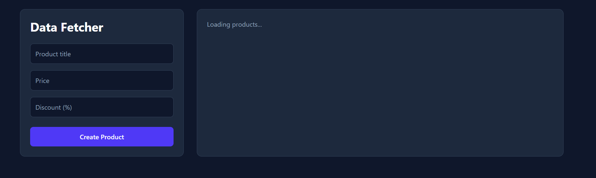
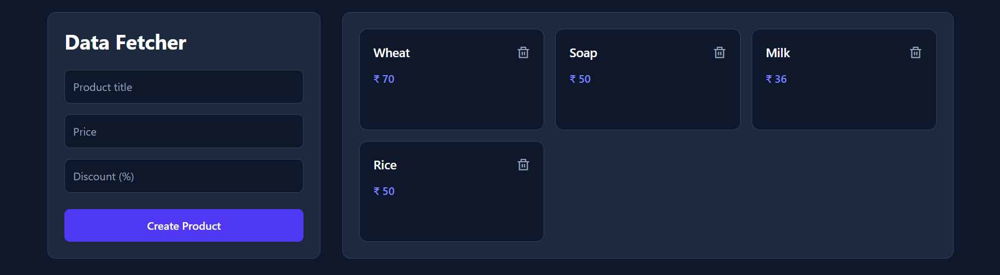

# SWRStack

A full-stack CRUD application built with React, TypeScript, Node.js, Express, MongoDB, and SWR for efficient data fetching.


## 🌐 Live Demo
- Live Demo: https://swr-stack.vercel.app/
- GitHub link: https://github.com/Nabin2002/SWRStack.git
## 📸 Screenshots

### Fetching Data


### Data Fetched



## ✨ Features
- Create, read, update, and delete products
- Modern data fetching using SWR (stale-while-revalidate)
- RESTful API with Express.js
- MongoDB database integration
- Dark mode professional UI
## 🛠 Tech Stack
- **Frontend :** React, TypeScript, Tailwind CSS, SWR
- **Backend :** Node.js, Express.js
- **Database :** MongoDB

## ⚙️ Installation

 **1️⃣ Install my-project with npm**

```bash
  git clone https://github.com/Nabin2002/SWRStack.git
  cd SWRStack
```
 **2️⃣ Install Dependencies**\
   *Frontend :*
```bash
  cd client
  npm install

```
*Backend :*
    
```bash
  cd server
  npm install

```
 **3️⃣ Environment Variables**

```bash
   PORT=8080
   DB= mongodb://localhost:27017/fetcher

```
**4️⃣ Run the project locally**\
    *Frontend :*
```bash
  npm run dev

```
   *Backend :*
    
```bash
 npm run dev
```
